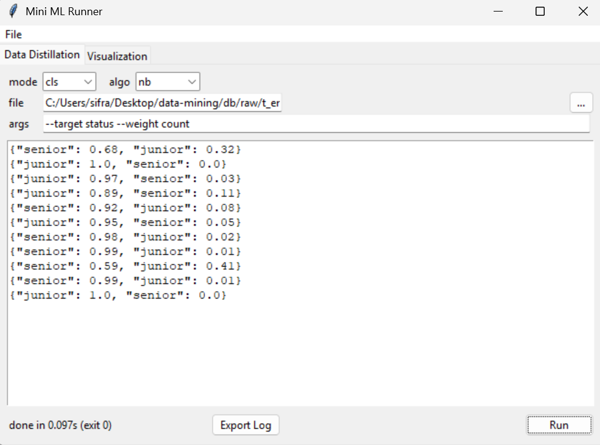

# data-mining-toolkit

## Overview

**data-mining-toolkit** is a framework for experimenting with and prototyping data mining algorithms.  
It provides tools for pattern mining, clustering, and classification, plus utilities for cleaning and preprocessing.  
The goal is to turn raw and noisy JSON queries from databases into distilled key information for machine learning.

---
UI preview  


## Features

| Category        | Details                                                                 |
|-----------------|-------------------------------------------------------------------------|
| Data preprocessing | Clean, normalize, distill raw JSON/db queries into structured datasets |
| Pattern mining  | Apriori, FP-Growth, Eclat, H-Mine                                       |
| Clustering      | K-Means, K-Medians, PAM (K-Medoids), Hierarchical (AGNES, DIANA), Fuzzy C-Means, Gaussian Mixture Models (EM), PCA, Bi-Clustering |
| Classification  | ID3, C4.5, C5.0, Naive Bayes, K-Nearest Neighbors, Perceptron, Logistic Regression, LDA, SVM |
| Evaluation      | Accuracy, precision/recall, confusion matrix, cross-validation          |
| Visualization   | Plots for clusters, decision trees, association rules, metrics          |
| Export          | Save models, results, and processed datasets (JSON, CSV, Excel)         |

## Quick Start

### Install
```bash
git clone https://github.com/ZifanSi/data-mining-toolkit.git
cd data-mining

# install dependencies
pip install -r requirements.txt